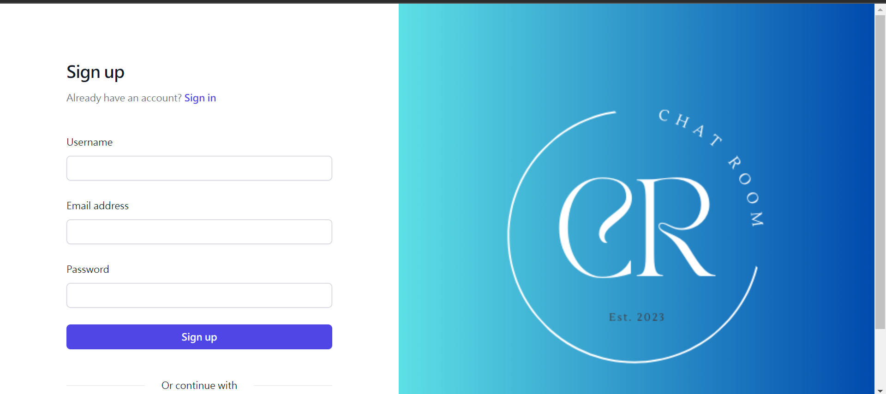
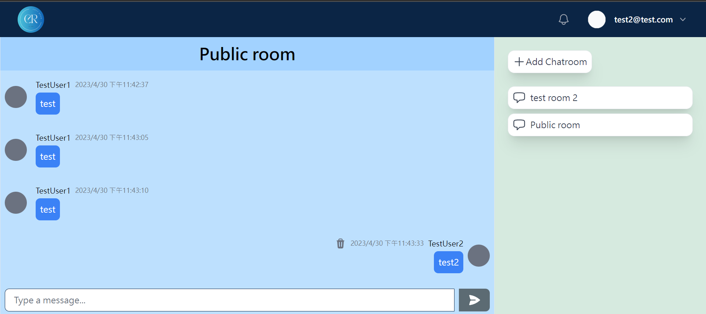
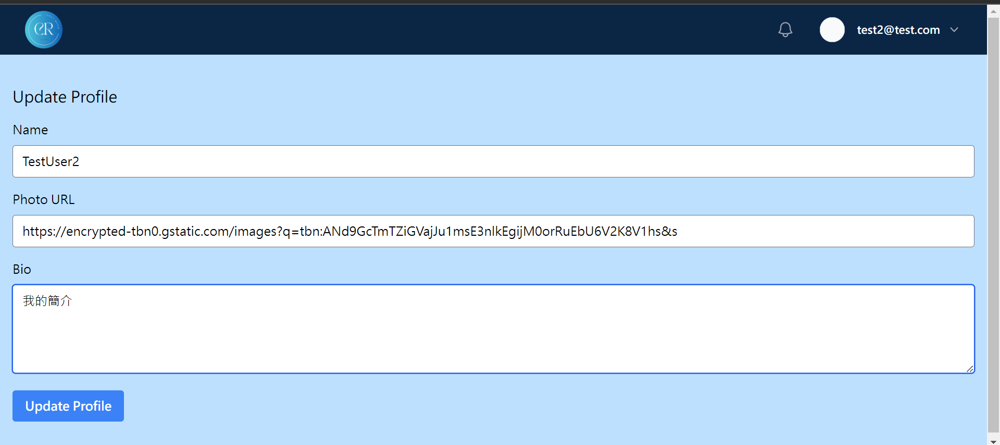
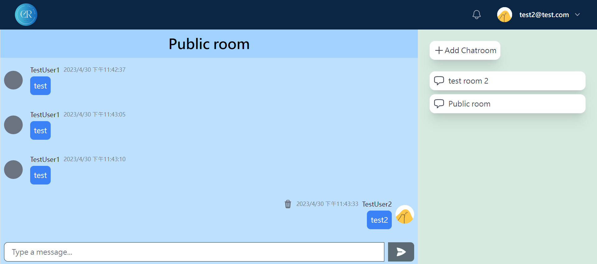
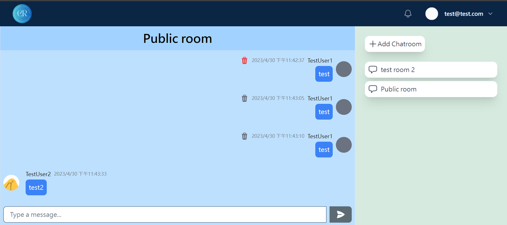
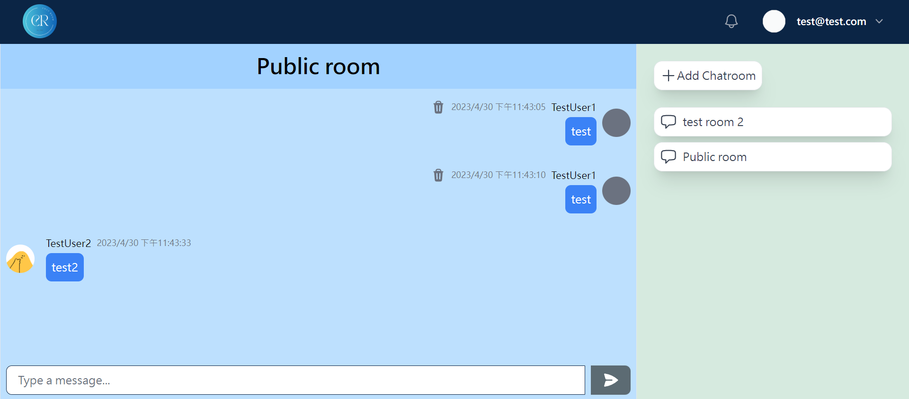

# Software Studio 2023 Spring Midterm Project

### Scoring

| **Basic components** | **Score** | **Check** |
|:---------------------|:---------:|:---------:|
| Membership Mechanism |    15%    |     Y     |
| Firebase page        |    5%     |     Y     |
| Database read/write  |    15%    |     Y     |
| RWD                  |    15%    |     Y     |
| Chatroom             |    20%    |     Y     |

| **Advanced tools**  | **Score** | **Check** |
|:--------------------|:---------:|:---------:|
| Using React         |    10%    |     Y     |
| Third-Party Sign In |    1%     |     Y     |
| Notification        |    5%     |     Y     |
| CSS Animation       |    2%     |     Y     |
| Security            |    2%     |     Y     |

| **Other useful functions**  | **Score** | **Check** |
|:----------------------------|:---------:|:---------:|
| Unsend Message              |    3%     |     Y     |
| UserProfile、Profile Picture |    2%     |     Y     |

---

### How to use

You will initially enter the login page.
You can register a new account or login with your account.

After login, you will enter the main page with public room.
點擊左上角的icon會回到首頁(public room)
你可以點擊右邊的add chatroom來增加一個chatroom，只有你自己
點進去chatroom後，你可以在下方輸入訊息，點擊右邊的send來送出訊息
按chatroom右上的icon可以加入人到chatroom

收回(垃圾桶icon)按一次會變紅色，再按一次刪除

### Function description

    1. 個人檔案 : 顯示個人資訊，包含名字、照片、個人簡介，可以進行修改。
    2. Google通知：點擊右上角的鈴鐺，會有通知詢問

### Firebase page link

    https://chat.nthu.dev/

### Others (Optional)

    Anything you want to say to TAs.

