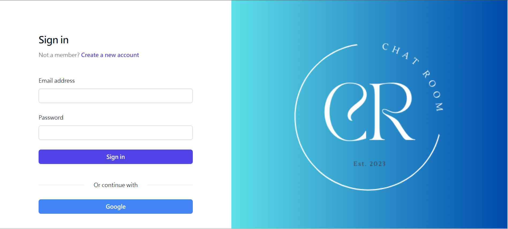

# Software Studio 2023 Spring Midterm Project

### Scoring

| **Basic components**                             | **Score** | **Check** |
| :----------------------------------------------- | :-------: | :-------: |
| Membership Mechanism                             | 15%       | Y         |
| Firebase page                                    | 5%        | Y         |
| Database read/write                              | 15%       | Y         |
| RWD                                              | 15%       | Y         |
| Chatroom                                         | 20%       | Y         |

| **Advanced tools**                               | **Score** | **Check** |
| :----------------------------------------------- | :-------: | :-------: |
| Using React                                      | 10%       | Y         |
| Third-Party Sign In                              | 1%        | Y         |
| Notification                                     | 5%        | Y         |
| CSS Animation                                    | 2%        | Y         |
| Security                                         | 2%        | Y         |

| **Other useful functions**                         | **Score** | **Check** |
| :----------------------------------------------- | :-------: |:---------:|
| Name of functions                                  | 1~5%     |     Y     |

---

### How to use
    There are several page.
    You will initially enter the login page.
    You can register a new account or login with your account.

    After login, you will enter the main page with public room.
    You can click the button to enter the chatroom in the right bar.

### Function description

    Describe your bonus function and how to use it.

### Firebase page link

    https://chat.nthu.dev/

### Others (Optional)

    Anything you want to say to TAs.

